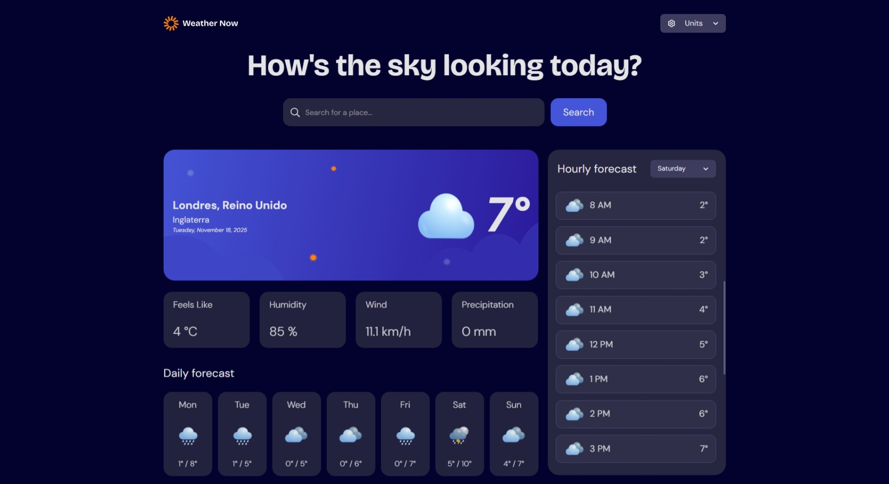

# Frontend Mentor - Weather app solution

This is a solution to the [Weather app challenge on Frontend Mentor](https://www.frontendmentor.io/challenges/weather-app-K1FhddVm49). Frontend Mentor challenges help you improve your coding skills by building realistic projects. 

## Table of contents

- [Overview](#overview)
  - [The challenge](#the-challenge)
  - [Screenshot](#screenshot)
  - [Links](#links)
- [My process](#my-process)
  - [Built with](#built-with)
  - [What I learned](#what-i-learned)
  - [Continued development](#continued-development)
  - [Useful resources](#useful-resources)
- [Author](#author)
- [Acknowledgments](#acknowledgments)

## Overview

### The challenge

Users can:

- Search for weather information by entering a location in the search bar
- View current weather conditions including temperature, weather icon, and location details
- See additional weather metrics like "feels like" temperature, humidity percentage, wind speed, and precipitation amounts
- Browse a 7-day weather forecast with daily high/low temperatures and weather icons
- View an hourly forecast showing temperature changes throughout the day
- Switch between different days of the week using the day selector in the hourly forecast section
- Toggle between Imperial and Metric measurement units via the units dropdown 
- Switch between specific temperature units (Celsius and Fahrenheit) and measurement units for wind speed (km/h and mph) and precipitation (millimeters) via the units dropdown
- View the optimal layout for the interface depending on their device's screen size
- See hover and focus states for all interactive elements on the page


### Screenshot

<p align="center" >
  
  &nbsp;&nbsp;&nbsp;&nbsp;&nbsp;&nbsp;
  
  &nbsp;&nbsp;&nbsp;&nbsp;&nbsp;&nbsp;
  
  &nbsp;&nbsp;&nbsp;&nbsp;&nbsp;&nbsp;
  
</p>

## Author

- Website - [Carla Johanna](https://github.com/devcjoha)
- Frontend Mentor - [@devcjoha](https://www.frontendmentor.io/profile/devcjoha)
- X - [@CarlitaJohanna](https://www.x.com/carlitajohana)


## 🚀 Live Deploys

- Solution URL: [code](https://github.com/devcjoha/weather-app-main)
- Live Site URL: [Deploy-Github-Pages]()

## My process

### Built with

<p align="center">

 &nbsp;&nbsp;&nbsp;&nbsp;&nbsp;&nbsp;

 &nbsp;&nbsp;&nbsp;&nbsp;&nbsp;&nbsp;

 &nbsp;&nbsp;&nbsp;&nbsp;&nbsp;&nbsp;

 &nbsp;&nbsp;&nbsp;&nbsp;&nbsp;&nbsp;

 &nbsp;&nbsp;&nbsp;&nbsp;&nbsp;&nbsp;

 &nbsp;&nbsp;&nbsp;&nbsp;&nbsp;&nbsp;

 &nbsp;&nbsp;&nbsp;&nbsp;&nbsp;&nbsp;

</p>

- ⚛️ React (component-based architecture).
- ⚡ Vite (fast development and packaging).
- 🎨 TailwindCSS (custom properties, dark/light theme).
- 🪝 Functional components and hooks (`useState`, `useEffect`, `useContext`).
- 📱 Responsive design with scroll snapping and custom styles.
- 🌤 Dynamic weather icons (`getWeatherIcon` + `isDay`).
- 🔍 Search bar with error handling and "not found" status.
- ⚡ Clear loading, error, and results statuses.

### 👩🏻‍🦱 What I learned
* How to consume the **Open-Meteo** API and normalize its responses so that components receive exactly the data they expect.

* The importance of differentiating UI states: *loading*, *error*, *not found*, and *success*.

* Handling **dark/light mode** with Tailwind and using `dark:` to apply dynamic styles.

* How to correctly propagate `is_day` from the `current` block and use it in combination with `weatherCode` to display dynamic icons.

* Best architectural practices in React: separating logic into hooks (`useCurrentWeather`, `useCurrentIcon`) and keeping components focused on rendering.

* Using **`useContext`** to avoid *prop drilling* and share global states (`darkMode`, `units`, `isDay`) throughout the application. - How to document and prepare a project for deployment on GitHub Pages using `import.meta.env.BASE_URL`.


### 💥 Continued development
* Add subtle animations to icons and transitions between states (e.g., day/night cycle).

* Extend the app to display additional data such as atmospheric pressure or UV index.

* Explore deployments on other platforms (Netlify, Vercel) besides GitHub Pages.

* Create a broader context to handle user preferences (language, units, theme).

### 🔗 Useful resources
* [TailwindCSS Documentation](https://tailwindcss.com/docs) – for responsive styles and dark mode.
* [Open‑Meteo API Docs](https://open-meteo.com/) – reference of the available `weatherCode` and parameters.
* [Frontend Mentor Community](https://www.frontendmentor.io/) – feedback and examples from other devs.
* [Vite Documentation](https://vitejs.dev/) – build and deploy configuration.
* [GitHub Pages Guide](https://docs.github.com/en/pages) – steps to deploy React/Vite projects.
* [React Context Docs](https://react.dev/reference/react/useContext) – to handle global states without prop drilling.

## 🚀 Deployment & Environment Setup

### 🧪 Environments

- **Local**: Use `/` as the base for routes.

- **Production (GitHub Pages)**: Use `/` as the base.

### ⚙️ Scripts disponibles

```bash
# Ejecuta el proyecto en desarrollo local
npm run dev

# Build estándar (no recomendado para GitHub Pages)
npm run build

# Build para GitHub Pages (usa base name correcto)
npm run build:gh

# Vista previa del build
npm run preview
```

### 🧠 Why this configuration?

## Asset Handling for GitHub Pages
* To ensure logos and images load correctly in production:
* All SVG logos are stored in public/assets/.
* Each extension in data.json uses only the filename for its logo, like "logo-devlens.svg".
* In the hook, image paths are constructed using:

```js
logo: `${import.meta.env.BASE_URL}assets/${item.logo}`;
```
This ensures compatibility with GitHub Pages, which serves your app from a subpath like /browser-extension-manager-ui/. Using import.meta.env.BASE_URL dynamically adjusts the asset path based on the deployment environment.


## Author

- Website - [Carla Johanna](https://github.com/devcjoha)
- Frontend Mentor - [@devcjoha](https://www.frontendmentor.io/profile/devcjoha)
- X - [@CarlitaJohanna](https://www.x.com/carlitajohana)
